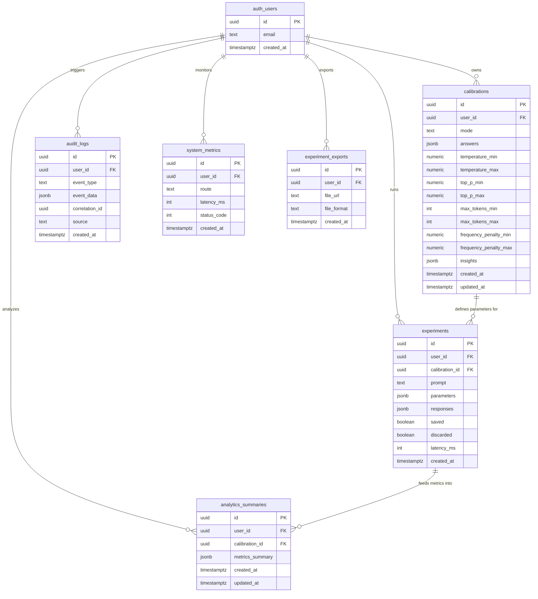
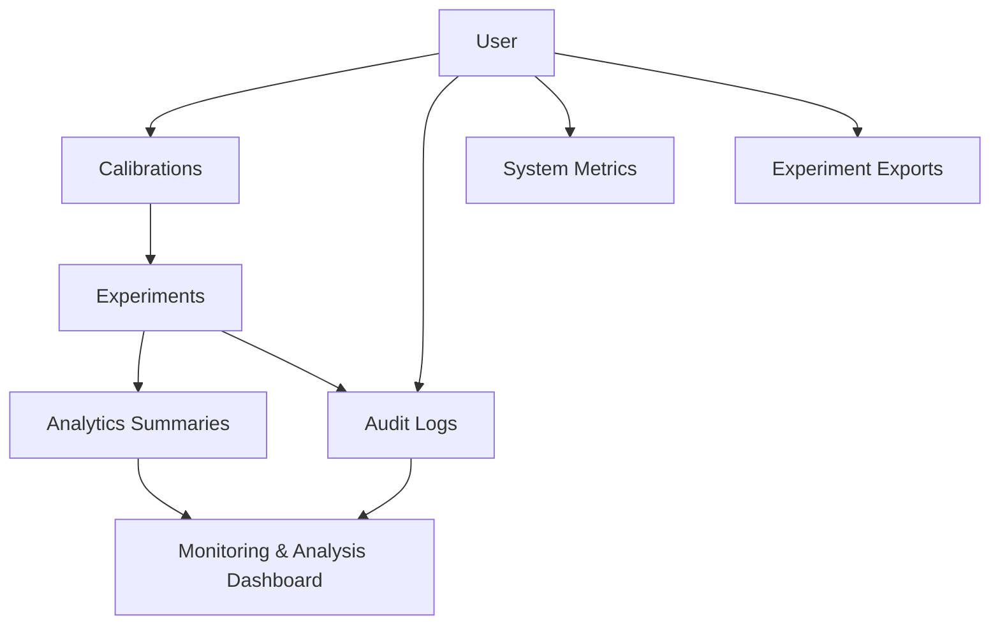

# 🧮 DATABASE ENTITY–RELATIONSHIP DIAGRAM (ERD)  
### *Precision + Personality Lab - Supabase Schema Overview (v2.4 Production)*

---

## 🧠 PURPOSE

This document provides a **complete structural representation** of the Precision + Personality Lab database schema, capturing all entities, relationships, constraints, and usage logic within the Supabase (PostgreSQL) backend.

The schema supports the entire **LLM experimentation lifecycle**, from user calibration through generation, analytics computation, and audit logging, ensuring full data integrity, traceability, and reproducibility.

---

## 🧱 SCHEMA OVERVIEW

The database operates under the **`public` schema** with **RLS (Row-Level Security)** enabled on all tables linked to authenticated users.

Primary entities:

- `auth.users` - Managed Supabase Auth users  
- `calibrations` - Stores model parameter configurations  
- `experiments` - Stores user prompts, parameters, and generated responses  
- `analytics_summaries` - Aggregated statistical results from experiments  
- `audit_logs` - Immutable chronological trace of system events  
- `system_metrics` - Middleware telemetry for performance analysis  
- `experiment_exports` - Tracks user export jobs (JSON, CSV, ZIP)

---

## 🧩 TOP-LEVEL RELATIONSHIP MAP



---

## 🔗 RELATIONAL MERMAID DIAGRAM - LOGICAL FLOW



---

## 🔍 TABLE-BY-TABLE STRUCTURE

### 🧭 1. auth.users
System-managed table (Supabase Auth).

| Field | Type | Description |
|--------|------|-------------|
| id | uuid | Primary user ID |
| email | text | User email (unique) |
| created_at | timestamptz | Registration timestamp |

Used By: All other tables via user_id foreign key.  
RLS: Enforced by Supabase’s internal auth policies.

---

### ⚙️ 2. calibrations
Defines LLM parameter configurations per user.
Each calibration session generates a unique range of parameter weights that directly influence later experiment generations.

| Field | Type | Description |
|--------|------|-------------|
| id | uuid | Primary key |
| user_id | uuid | References auth.users.id |
| mode | text | Calibration mode (quick / deep) |
| answers | jsonb | Raw quiz answers for calibration |
| temperature_min | numeric | Lower range bound for creativity |
| temperature_max | numeric | Upper range bound for creativity |
| top_p_min | numeric | Lower bound for nucleus sampling |
| top_p_max | numeric | Upper bound for nucleus sampling |
| max_tokens_min | int | Minimum generation length |
| max_tokens_max | int | Maximum generation length |
| frequency_penalty_min | numeric | Lower bound for penalty |
| frequency_penalty_max | numeric | Upper bound for penalty |
| insights | jsonb | Derived model behavioral notes |
| created_at | timestamptz | Creation timestamp |
| updated_at | timestamptz | Last update timestamp |

**Relations:**
- user_id → auth.users.id  
- id → experiments.calibration_id

---

### 🧪 3. experiments
Records all LLM generations, including prompt input, model parameters, and response payloads.

| Field | Type | Description |
|--------|------|-------------|
| id | uuid | Primary key |
| user_id | uuid | References auth.users.id |
| calibration_id | uuid | References calibrations.id |
| prompt | text | User-entered query |
| parameters | jsonb | Serialized model configuration used |
| responses | jsonb | Array of generated outputs |
| saved | boolean | Flag for retained results |
| discarded | boolean | Flag for deleted results |
| latency_ms | int | API inference duration |
| created_at | timestamptz | Insert timestamp |

**Relations:**
- user_id → auth.users.id  
- calibration_id → calibrations.id  
- Feeds into → analytics_summaries

---

### 📊 4. analytics_summaries
Aggregates performance metrics across all experiments linked to a specific calibration.

| Field | Type | Description |
|--------|------|-------------|
| id | uuid | Primary key |
| user_id | uuid | References auth.users.id |
| calibration_id | uuid | References calibrations.id |
| metrics_summary | jsonb | Cached analytics object: { avgCreativity, avgCoherence, avgStructure, avgLatency } |
| created_at | timestamptz | Creation timestamp |
| updated_at | timestamptz | Last recompute time |

---

### 🧾 5. audit_logs
Immutable record of all system-level events, ensuring full traceability of user actions and background processes.

| Field | Type | Description |
|--------|------|-------------|
| id | uuid | Primary key |
| user_id | uuid | References auth.users.id |
| event_type | text | Categorical event label |
| event_data | jsonb | Payload (metadata, route, etc.) |
| correlation_id | uuid | Grouping ID across distributed actions |
| source | text | Origin (client, server, realtime) |
| created_at | timestamptz | Event timestamp |

**Example Events:**  
`experiment_created`, `experiment_generated`, `calibration_completed`, `analytics_updated`, `realtime_connected`.

---

### 🧮 6. system_metrics
Tracks API performance and telemetry for backend observability.

| Field | Type | Description |
|--------|------|-------------|
| id | uuid | Primary key |
| user_id | uuid | References auth.users.id |
| route | text | API route name |
| latency_ms | int | Request duration |
| status_code | int | HTTP response code |
| created_at | timestamptz | Timestamp |

**Populated By:** `withTelemetry()` middleware on every API route.

---

### 🧳 7. experiment_exports
Tracks user-triggered data export operations (JSON / CSV / ZIP).  
Supports long-running jobs with async completion logs.

| Field | Type | Description |
|--------|------|-------------|
| id | uuid | Primary key |
| user_id | uuid | References auth.users.id |
| file_url | text | Supabase storage link or CDN URL |
| file_format | text | Output format (json, csv, zip) |
| created_at | timestamptz | Timestamp of job creation |

---

## ⚙️ SAMPLE SQL STUBS (REPRODUCIBLE)

```sql
create table public.calibrations (
  id uuid primary key default uuid_generate_v4(),
  user_id uuid references auth.users(id),
  mode text,
  answers jsonb,
  temperature_min numeric,
  temperature_max numeric,
  top_p_min numeric,
  top_p_max numeric,
  max_tokens_min int,
  max_tokens_max int,
  frequency_penalty_min numeric,
  frequency_penalty_max numeric,
  insights jsonb,
  created_at timestamptz default now(),
  updated_at timestamptz default now()
);

create table public.experiments (
  id uuid primary key default uuid_generate_v4(),
  user_id uuid references auth.users(id),
  calibration_id uuid references calibrations(id),
  prompt text,
  parameters jsonb,
  responses jsonb,
  saved bool default false,
  discarded bool default false,
  latency_ms int,
  created_at timestamptz default now()
);
```

*(All tables have RLS enabled and policies enforcing auth.uid() = user_id.)*

---

## 🧩 REFERENTIAL INTEGRITY MODEL

| Constraint | Description | Enforcement |
|-------------|-------------|--------------|
| FK: experiments.user_id → users.id | Each experiment must belong to an authenticated user | ✅ |
| FK: experiments.calibration_id → calibrations.id | Experiments inherit calibration context | ✅ |
| FK: analytics_summaries.calibration_id → calibrations.id | Aggregated metrics align to calibration scope | ✅ |
| FK: audit_logs.user_id → users.id | Events are traceable per user | ✅ |
| FK: experiment_exports.user_id → users.id | Export logs scoped to user | ✅ |

---

## 🧾 NOTES ON DATA FLOW & RELATIONSHIP STABILITY

All tables share a one-to-many relationship to `auth.users`.

Cross-table relationships ensure experiment reproducibility: any experiment can be rebuilt exactly from its calibration and parameter logs.

The architecture preserves a causal chain:

```bash
calibration → experiment → analytics → audit → metrics
```

Each node in that chain creates at least one audit entry.  
Realtime subscriptions are scoped to individual users, respecting RLS.

---

## 🏁 SUMMARY

| Design Pillar | Description |
|----------------|-------------|
| **Traceability** | Every experiment and metric tied to a unique calibration + audit trail |
| **Security** | RLS + UUID isolation + Supabase Auth enforcement |
| **Reproducibility** | Parameter logs + metrics summaries preserved |
| **Extensibility** | New experiment types or LLM providers can slot in cleanly |
| **Observability** | Telemetry and audit logs capture system health over time |

The **Precision + Personality Lab database schema** is built for scientific rigor, an architecture where every AI experiment is accountable, measurable, and permanently reproducible.