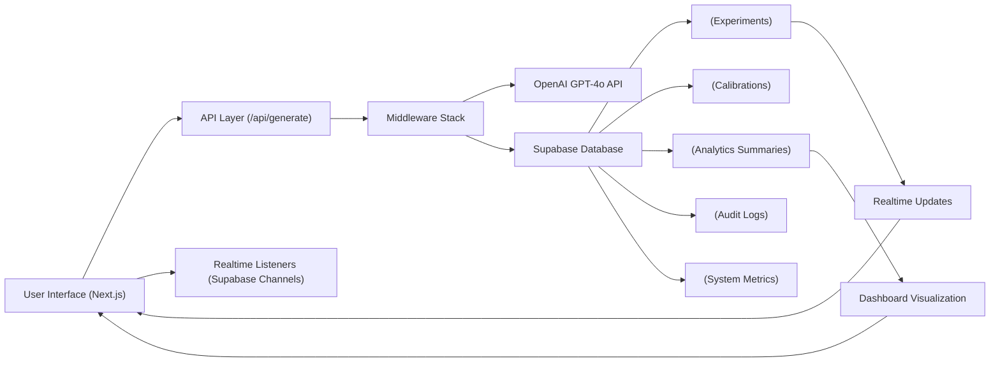
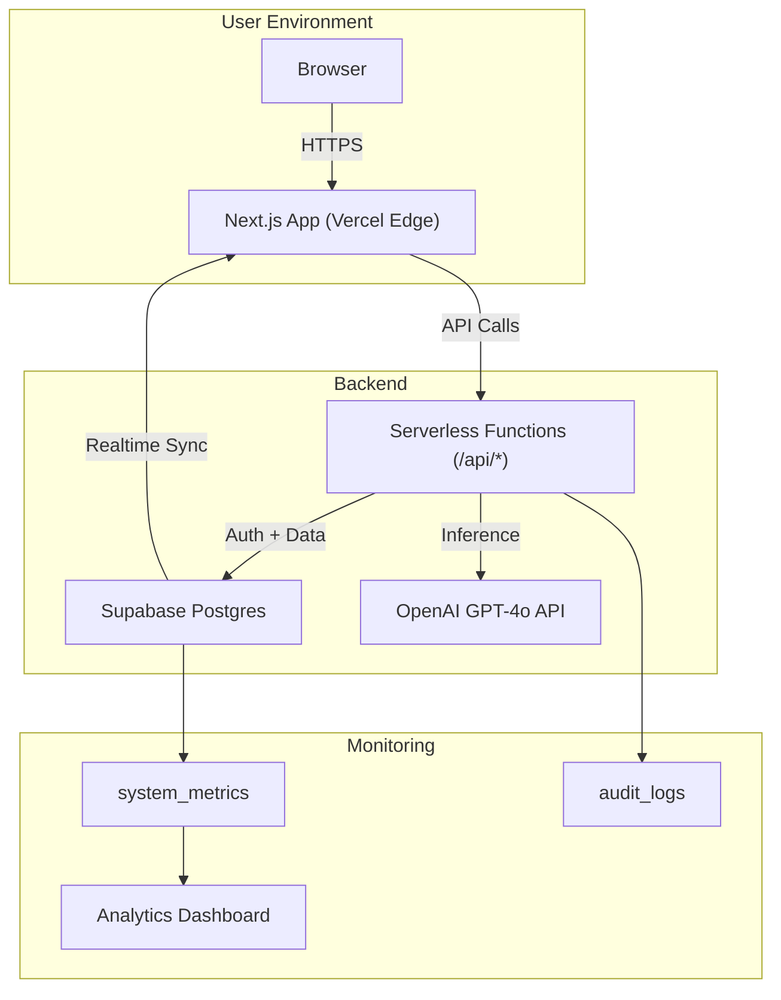

# 🧭 SYSTEM TOPOLOGY DIAGRAM - PRECISION + PERSONALITY LAB  
### *Version 2.4 - Production Infrastructure Overview*

---

## 🧠 PURPOSE

This document visualizes the **entire system topology** for the Precision + Personality Lab (PPL), capturing how **frontend**, **backend**, **database**, and **external AI integrations** collaborate in real time.

It is intended for:
- Engineers onboarding to the project.
- Security or architecture audits.
- Documentation for research reproducibility.

---

## ⚙️ HIGH-LEVEL FLOW



---

## 🧩 COMPONENT LAYERS

### 🧱 1. Frontend (Next.js 15 + Zustand)

| Module | Path | Description |
|---------|------|-------------|
| **Calibration Flow** | `/app/calibration` | Interactive quiz generating parameter ranges |
| **Experiment Studio** | `/app/experiment` | Core text-generation interface for OpenAI calls |
| **Dashboard** | `/app/dashboard` | Metrics and analytics visualization |
| **UI Stores (Zustand)** | `/store/*` | Centralized app state for calibration, experiments, and metrics |
| **Realtime Engine** | `/hooks/use-realtime.ts` | Subscribes to Supabase events for live data sync |

**Key Traits:**
- Reactive UX with instant data refresh (no reloads)
- Optimistic UI when saving calibrations or experiments
- Framer Motion animations lazy-loaded via `lazy-motion.ts`
- Edge-prefetched navigation for near-zero route latency

---

### 🧩 2. Middleware & API Layer

**Purpose:** All server-side logic flows through a composable middleware chain ensuring security, telemetry, and observability.

```tsx
export const POST = withErrorHandler(
  withTelemetry(
    withRateLimit(generateHandler)
  )
);
```

| Middleware | Function | Outputs |
|-------------|-----------|----------|
| **withRateLimit** | Throttles per IP/user | Returns 429 + audit entry |
| **withTelemetry** | Logs latency, user, route, success/failure | Inserts into `system_metrics` |
| **withErrorHandler** | Captures unhandled exceptions | JSON-safe responses + `audit_logs` entry |

**Core Endpoints:**
- `/api/generate` → LLM pipeline execution
- `/api/health` → system ping check
- `/api/exports` → data export handler

---

### 🧩 3. LLM ENGINE (OpenAI GPT-4o Mini)

| Parameter | Description |
|------------|--------------|
| `temperature` | Controls creativity / randomness |
| `top_p` | Nucleus sampling probability threshold |
| `frequency_penalty` | Penalizes repetition frequency |
| `presence_penalty` | Encourages diversity of ideas |
| `max_tokens` | Limits output length |

**Pipeline Sequence:**
1. Fetch latest calibration  
2. Map parameters to LLM request  
3. Call OpenAI API (stream or synchronous)  
4. Compute metrics (creativity, coherence, completeness)  
5. Save to `experiments` + `analytics_summaries`  
6. Log `experiment_generated` event

**LLM Response Multiplexing:** Supports up to **5 concurrent completions** using `Promise.allSettled()` for safe aggregation.

---

### 🧩 4. Database (Supabase)

The Supabase Postgres layer powers persistence, realtime sync, and analytics aggregation.

#### Schema Overview

| Table | Function | Linked To |
|--------|-----------|------------|
| `auth.users` | Managed user registry | Primary key for all user-owned tables |
| `calibrations` | Stores parameter ranges + answers | → `experiments` (via `calibration_id`) |
| `experiments` | Core prompt + response dataset | → `analytics_summaries` |
| `analytics_summaries` | Cached performance metrics | ← aggregated from `experiments` |
| `audit_logs` | Immutable event records | ← middleware + app events |
| `system_metrics` | Performance telemetry | ← middleware instrumentation |
| `experiment_exports` | Async export jobs | → `audit_logs` for job completion |

**Key Relationships:**
```bash
users ──< calibrations ──< experiments ──> analytics_summaries
users ──< audit_logs
users ──< system_metrics
users ──< experiment_exports
```

**Data Flow Contract:**

| Direction | From | To | Purpose |
|------------|------|----|----------|
| → | Calibrations | Experiments | Parameter inheritance |
| → | Experiments | Analytics Summaries | Computed metrics aggregation |
| → | API Middleware | Audit Logs | Event and error traceability |
| → | Experiments | Realtime Engine | Push updates to UI |

---

### 🧩 5. Realtime Infrastructure

**Powered By:** Supabase Realtime (Postgres Changes API)

| Channel | Subscribed Table | Event Triggers |
|----------|------------------|----------------|
| `calibration_updates` | `calibrations` | INSERT, UPDATE |
| `experiment_stream` | `experiments` | INSERT, DELETE |
| `analytics_refresh` | `analytics_summaries` | UPDATE |

**UI Impact:**
- Dashboard updates instantly when a new experiment is saved.  
- Realtime events emit toast notifications + animated refresh indicators.  
- Audit logs capture connection lifecycle:  
  - `realtime_connected`  
  - `realtime_error`  
  - `realtime_disconnected`

---

### 🧩 6. Audit & Telemetry Flow

**Audit Logging**

Every major lifecycle event is inserted into `audit_logs`:

| Category | Example Event | Source |
|-----------|----------------|---------|
| Calibration | `calibration_completed` | `/lib/api/calibrations.ts` |
| Experiment | `experiment_generated` | `/api/generate` |
| Realtime | `realtime_connected` | `/hooks/use-realtime.ts` |
| Metrics | `analytics_updated` | `/store/metrics-store.ts` |
| Export | `export_completed` | `/lib/api/exports.ts` |

**Telemetry Metrics**
- Collected by `withTelemetry()` middleware  
- Written to `system_metrics`  
- Fields: `route`, `latency_ms`, `user_id`, `status_code`, `created_at`

---

## 🔒 SECURITY INTEGRATION

- JWT Auth validation on all routes via Supabase session context.  
- RLS policies across all data tables (`auth.uid()` enforced).  
- Rate Limiting middleware per IP + user.  
- TLS enforced between frontend ↔ Supabase ↔ OpenAI.  
- Immutable Audit Trail ensures no retroactive log modification.

---

## ☁️ DEPLOYMENT TOPOLOGY



---

### Runtime Summary

| Component | Host | Mode |
|------------|------|------|
| **Frontend** | Vercel Edge Network | SSR + CSR Hybrid |
| **Backend API** | Next.js Server Functions | Containerized |
| **Database** | Supabase Cloud | Managed PostgreSQL |
| **LLM** | OpenAI GPT-4o | External HTTPS API |
| **Monitoring** | Supabase Tables | Centralized logging |

---

## 🧾 EXECUTION TIMELINE SNAPSHOT

| Step | Event | Avg. Latency |
|------|--------|--------------|
| User submits prompt | → `/api/generate` | ~40ms |
| LLM completes | GPT-4o response | ~2.3s |
| Supabase insert | experiment record | ~90ms |
| Realtime broadcast | dashboard update | < 200ms |
| Metrics recompute | analytics_summaries | ~120ms |

---

## 🧭 DESIGN TAKEAWAYS

- Every module is observable, traced, and recoverable.  
- Middleware chain ensures uniform error handling.  
- Database schema mirrors experiment reproducibility philosophy.  
- Edge-deployed runtime enables global low-latency access.  

The architecture balances **precision engineering** and **creative freedom**, perfectly aligned with the product’s mission.