# 🔄 WORKFLOW SEQUENCE DIAGRAM - EXPERIMENT LIFECYCLE + OBSERVABILITY FLOW  
### *Precision + Personality Lab (v2.4 Production)*

---

## 🧠 PURPOSE

This document captures **the complete runtime behavior** of the Precision + Personality Lab system -  
from **user calibration** through **prompt generation**, **metric computation**, and **data export** -  
including all background processes such as **telemetry**, **audit logs**, and **realtime updates**.

---

## ⚙️ PHASE MAP OVERVIEW

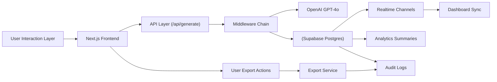

---

## 🧩 1️⃣ CALIBRATION SEQUENCE (Interactive Phase)

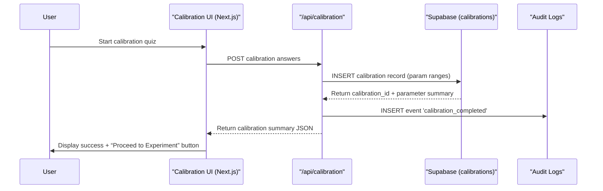

---

## 🧩 2️⃣ EXPERIMENT GENERATION SEQUENCE (Core LLM Phase)

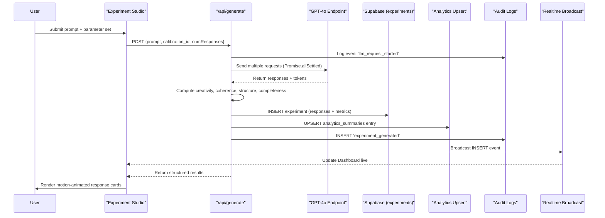

---

## 🧩 3️⃣ ANALYTICS PIPELINE FLOW

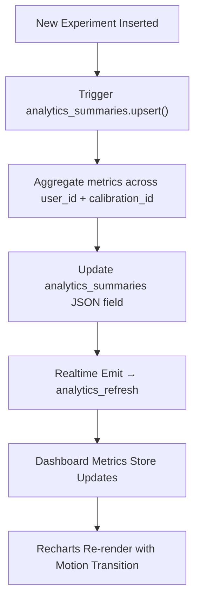

---

## 🧩 4️⃣ REALTIME SYSTEM SYNCHRONIZATION

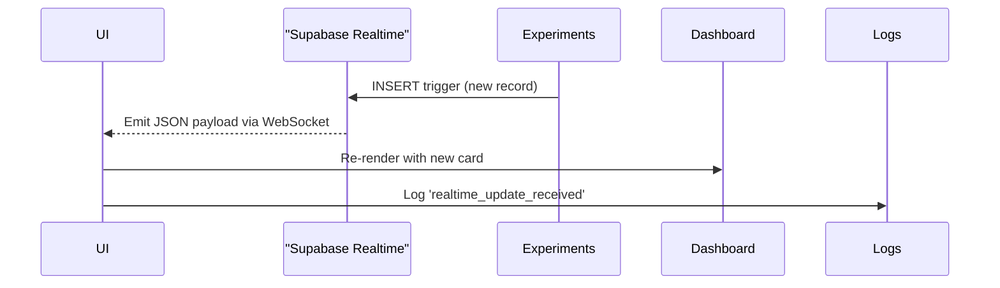

---

## 🧩 5️⃣ EXPORT & DATA PERSISTENCE WORKFLOW

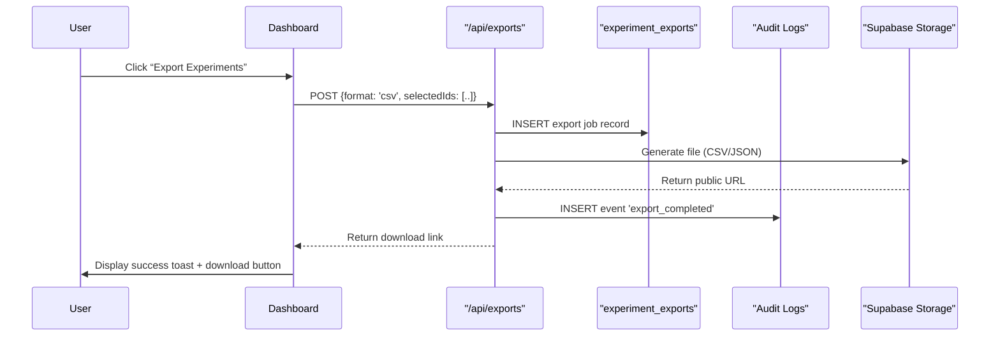

---

## 🧩 6️⃣ TELEMETRY & PERFORMANCE OBSERVABILITY

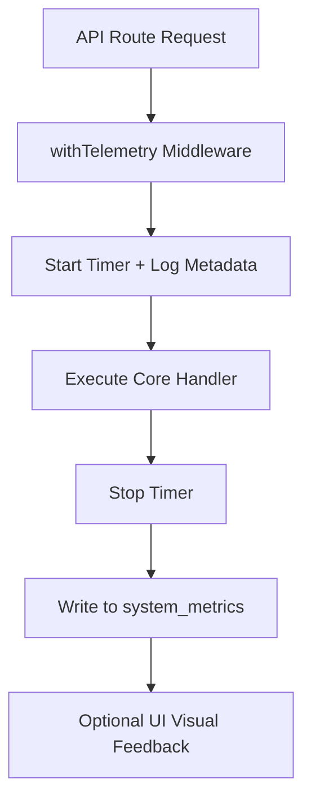

---

## 🧩 7️⃣ AUDIT LOGGING PIPELINE

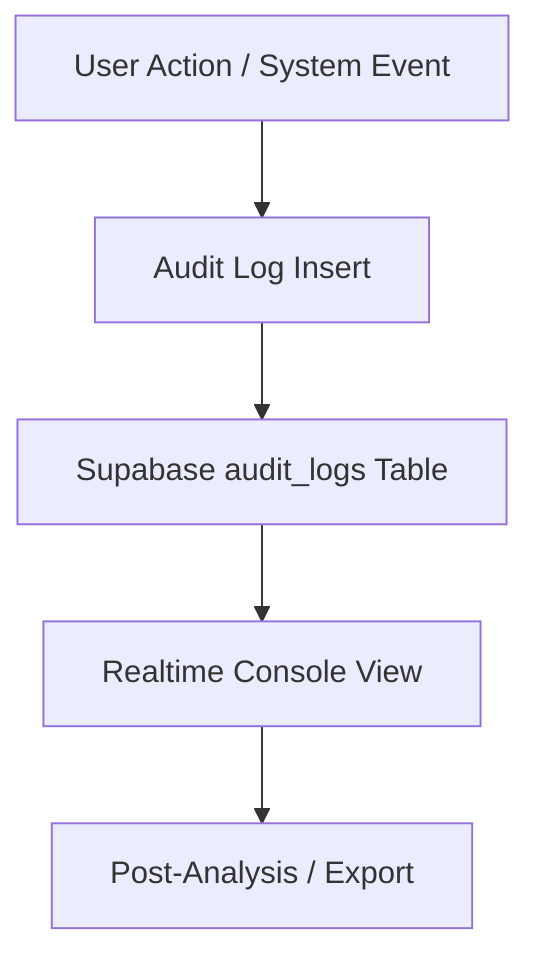

---

## 🧩 8️⃣ COMPLETE END-TO-END EVENT FLOW

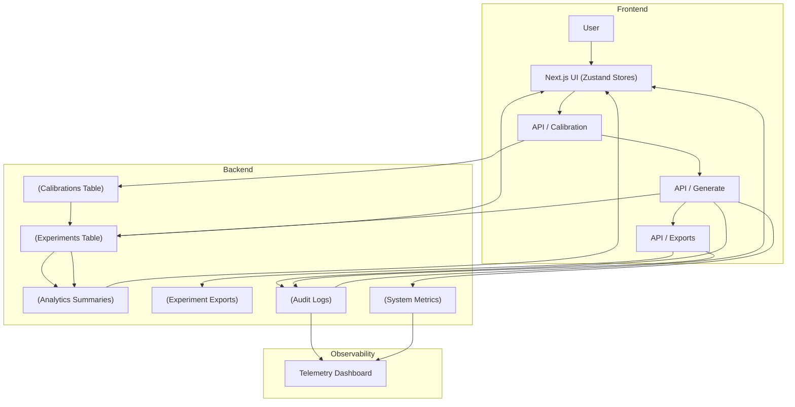

---

## 🧠 10️⃣ EXCEPTION HANDLING PATHS

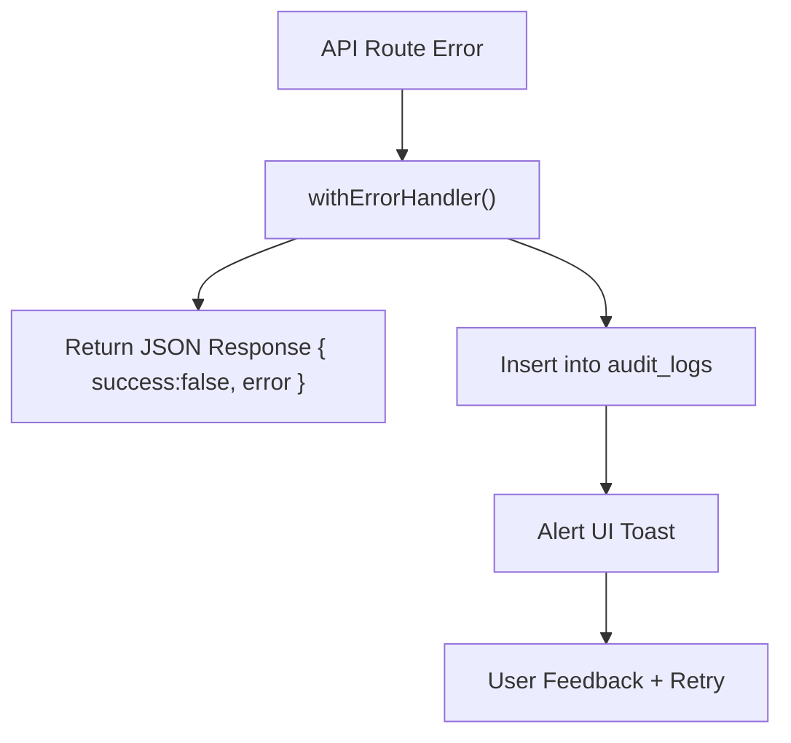

---

## 🧾 11️⃣ REPRODUCIBILITY CHAIN

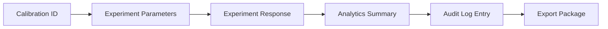

---

## 🧱 12️⃣ SUMMARY - DATA + OBSERVABILITY INTEGRATION

| Layer | Primary Action | Observability Trace |
|--------|----------------|----------------------|
| Calibration | Create parameter range | calibration_completed |
| Experiment | Generate response | experiment_generated, llm_request_started |
| Analytics | Aggregate metrics | analytics_updated |
| Realtime | Sync dashboard | realtime_update_received |
| Telemetry | Record latency | system_metrics |
| Audit | Persist event logs | audit_logs |
| Export | Deliver user data | export_completed |

---

## 🧩 13️⃣ DESIGN INSIGHTS

- **Full Observability Stack** - every request path logs telemetry + audit simultaneously.  
- **Causal Event Chain** - allows replaying full experiment lifecycle from raw calibration to analytics summary.  
- **Realtime UX Feedback** - immediate dashboard updates create "live lab" interactivity.  
- **Error Containment** - unified `jsonResponse()` ensures consistent frontend error rendering.  
- **Time-Based Debugging** - correlation IDs link events across tables and logs.  

---

## 🏁 CONCLUSION

This workflow defines the **Precision + Personality Lab’s operational backbone**,  
a precisely instrumented architecture ensuring every model action, metric computation, and export is **traceable, auditable, and reproducible**.

> “Every experiment tells a story, and every story leaves a measurable trace.”

