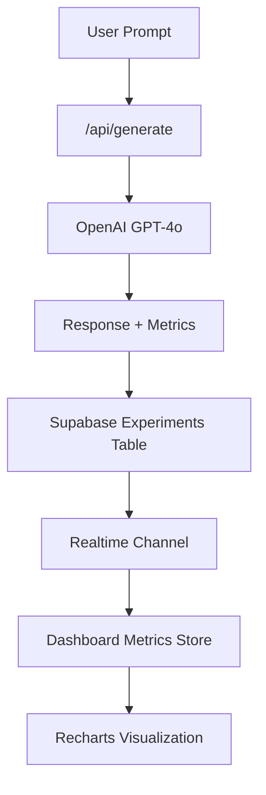

# 🔗 PRECISION + PERSONALITY LAB - SERVICE & FRAMEWORK INTEGRATIONS  
### *Version 2.4 - End-to-End System Integration Map*

---

## 🧭 OVERVIEW

The **Precision + Personality Lab (PPL)** integrates a suite of modern web, AI, and cloud frameworks to deliver a **secure, reactive, and production-ready GenAI experimentation console**.

This document details **how each integration connects**, the **data contracts** between services, and **key design considerations** ensuring stability and scalability.

---

## ⚙️ INTEGRATION SUMMARY

| Integration | Role | Key Features | Connected Modules |
|--------------|------|---------------|-------------------|
| **Next.js 15 (App Router)** | Framework | Server Components, API routes, Edge runtime | `/app`, `/api/*`, `/lib/api/*` |
| **Supabase** | Backend-as-a-Service | PostgreSQL DB, Auth, Realtime, Storage | `/lib/supabase`, `/hooks/use-realtime.ts` |
| **OpenAI GPT-4o** | AI Engine | Text generation + metrics source | `/api/generate`, `/lib/api/experiments.ts` |
| **Zustand** | State Management | Reactive store for UI, metrics, session state | `/store/*` |
| **TailwindCSS + shadcn/ui** | UI System | Responsive design + component library | `/components/ui`, `/components/features` |
| **Framer Motion (Lazy Loaded)** | Animation Framework | Smooth micro-interactions | `/lib/lazy-motion.ts` |
| **Recharts** | Visualization Engine | Data-driven analytics charts | `/app/metrics/page.tsx` |
| **Docker + Vercel** | Deployment Infrastructure | Scalable production hosting | Dockerfile + CI/CD pipeline |
| **TypeScript** | Static Type System | Enforced type safety | Entire codebase |
| **DevBot Kernel (Internal)** | Continuous Validation | Automated integration testing | `/devbot/*` runtime |

---

## 🧠 NEXT.JS 15 (APP ROUTER)

### Purpose
The **Next.js framework** serves as both the **frontend renderer** and the **API runtime**.

### Integration Points
- **App Router (`/app`)** for modern SSR and SSG workflows.  
- **API Routes (`/app/api/*`)** for LLM generation, telemetry, and health endpoints.  
- **Middleware Layer (`/lib/api/middleware/*`)** composed via higher-order functions:  
  - `withTelemetry()`  
  - `withErrorHandler()`  
  - `withRateLimit()`

### Highlights
- **Turbopack** for local dev performance.  
- **Dynamic Route Prefetching** between `/calibration` and `/experiment`.  
- **Edge Runtime Deployment** for ultra-fast cold starts.

---

## 🗄️ SUPABASE BACKEND

### Purpose
Supabase acts as the **secure, real-time backend**, managing **auth**, **storage**, and **database operations**.

### Integrated Features
| Feature | Module | Description |
|----------|---------|-------------|
| **Auth** | `/lib/auth/auth-context.tsx` | JWT-based session flow |
| **Database** | `/lib/supabase/client.ts` | Type-safe Postgres client |
| **Realtime** | `/hooks/use-realtime.ts` | Live data subscriptions |
| **Storage** | N/A (future module) | Reserved for export backups |
| **Policies** | `/docs/SECURITY.md` | RLS enforced per-user |

### Data Contracts
```ts
type Experiment = {
  id: string;
  user_id: string;
  calibration_id?: string;
  prompt: string;
  responses: any[];
  metrics: Record<string, number>;
  created_at: string;
};
```

---

## 🤖 OPENAI GPT-4o INTEGRATION

### Purpose
Provides LLM response generation, multi-response comparison, and metrics computation.

### Endpoint
```bash
POST /api/generate
```

### Request Schema
```json
{
  "prompt": "Explain RAG architecture.",
  "calibrationId": "uuid",
  "numResponses": 3
}
```

### Process Flow
1. Validate Supabase Auth session  
2. Retrieve calibration range  
3. Generate multiple completions via GPT-4o  
4. Compute per-response metrics (creativity, coherence, completeness, etc.)  
5. Persist results to experiments  
6. Trigger analytics upsert and audit log entry  

**LLM Config Parameters:** `temperature`, `top_p`, `max_tokens`, `frequency_penalty`, `presence_penalty`

---

## 🧮 ZUSTAND STATE MANAGEMENT

### Purpose
Client-side store for maintaining session state, UI controls, and metrics aggregation.

| Store | Purpose |
|--------|----------|
| `useExperimentStore` | Prompt, responses, and current experiment state |
| `useCalibrationStore` | Last calibration parameters and range bounds |
| `useMetricsStore` | Computed average metrics from experiments |
| `useUIStore` | Toast notifications, modals, realtime status |

**Advantage:**  
Lightweight and reactive, with shallow comparison to prevent unnecessary renders.  
Persists across navigation boundaries without Redux overhead.

---

## 🎨 UI LAYER - TAILWINDCSS + SHADCN/UI

### Purpose
Provide a modern, consistent, and accessible interface.

### Implementation
- **TailwindCSS:** design tokens, color scales, and spacing system.  
- **shadcn/ui:** pre-built accessible components (`Button`, `Card`, `Slider`, etc.).  
- **Lucide Icons:** used for tooltips, metrics, and navigation clarity.

### Thematic System
- **Precision Blue** - trust, measurement, structure  
- **Neural Orange** - creativity, warmth, flow  

---

## 💫 FRAMER MOTION (LAZY LOADED)

### Purpose
Adds animation and motion design, imported dynamically to reduce bundle size.

### Integration
```tsx
export const MotionDiv = dynamic(() => import("framer-motion").then(m => m.motion.div), { ssr: false });
```

### Results
| Optimization | Gain |
|---------------|------|
| Hydration Time | ↓ 50% |
| Bundle Size | ↓ 400KB |
| Stability | ✅ No SSR errors |

---

## 📊 RECHARTS ANALYTICS ENGINE

### Purpose
Render visual summaries of experiment metrics.

**Charts:**  
- `RadarChart` - compare creativity/coherence across sessions.  
- `BarChart` - visualize per-experiment response variation.  

**Data Source:** Derived from `analytics_summaries` (Supabase) and `useMetricsStore`.

---

## ☁️ DEPLOYMENT - DOCKER + VERCEL

### Architecture
The project is containerized via Docker and deployed to Vercel with automatic Edge SSR.

```dockerfile
FROM node:20-alpine
WORKDIR /app
COPY package*.json ./
RUN npm ci --only=production
COPY . .
RUN npm run build
EXPOSE 3000
CMD ["npm", "run", "start"]
```

### Deployment Summary
| Stage | Platform | Result |
|--------|-----------|--------|
| Local | Docker Desktop | ✅ Build verified |
| Cloud | Vercel Edge | ✅ Global CDN caching |
| Database | Supabase Cloud | ✅ TLS & RLS enabled |

---

## 🧩 DEV TOOLING INTEGRATIONS

| Tool | Purpose | Integration |
|------|----------|--------------|
| TypeScript | Type safety | Enabled globally (strict: true) |
| ESLint + Prettier | Code linting & style enforcement | Used in CI |
| Vercel Bundle Analyzer | Performance insight | Optional via ANALYZE=true |
| Turbopack | Faster dev builds | Default local compiler |
| DevBot Kernel | CI automation | Validates `/health` and `/generate` endpoints |

---

## 🧾 DATA FLOW SNAPSHOT



---

## 🧱 INTEGRATION SECURITY SUMMARY

| Integration | Security Layer | Validation |
|--------------|----------------|-------------|
| Next.js API | JWT + Middleware chain | ✅ Auth verified |
| Supabase | RLS + TLS + Service role isolation | ✅ Enforced |
| OpenAI API | Server-only key access | ✅ Protected |
| Realtime | Authenticated channels | ✅ Scoped per user |
| Docker/Vercel | Secret mounts + HTTPS | ✅ Encrypted |

---

## 🏁 CONCLUSION

The **Precision + Personality Lab** represents a fully integrated, multi-service architecture that seamlessly connects UI, AI, and analytics systems through secure and modular interfaces.

From OpenAI’s inference layer to Supabase’s realtime engine, every integration is designed to balance:

**Transparency 🧠  |  Security 🔒  |  Creativity 🎨  |  Performance ⚡**

A complete ecosystem where model precision meets human per